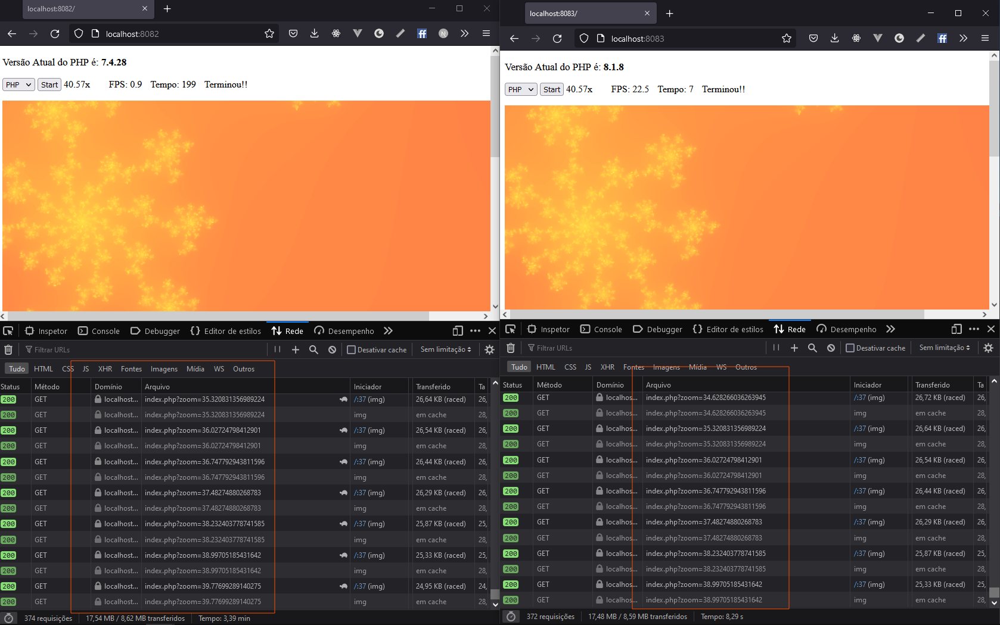

## 💻 Project
 

The project consists of generating a fractal several times increasing the zoom up to 40x, every time the zoom increases the fractal on the server side is regenerated, at the end we have the time.
 

Performance test, at each request that the javascript makes it zooms and the server needs to create the image with the new zoom, the javascript is waiting for the server to return the image to render on the screen and when the server returns the javascript makes a new one request by zooming in.

I performed the test with php, comparing the time of php 7.4 with php 8.1 + jit enabled.
 

Below we have the test result.
 

<h1 align="center"></img></h1>

---

With 💜 by Henrique Brites 👋